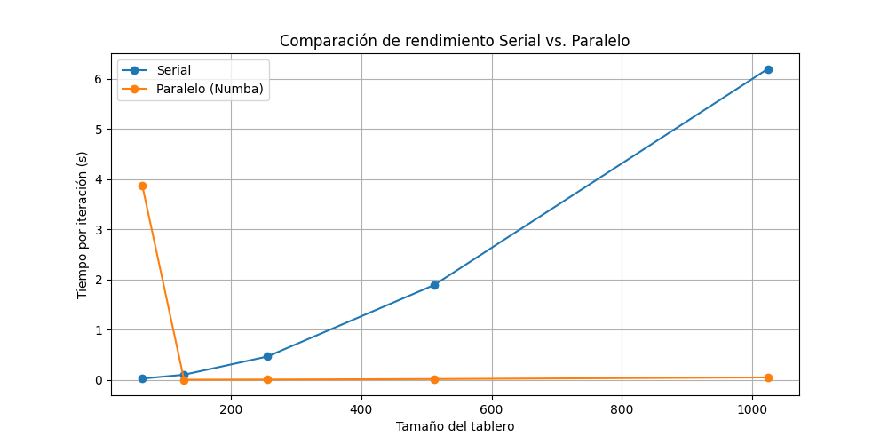
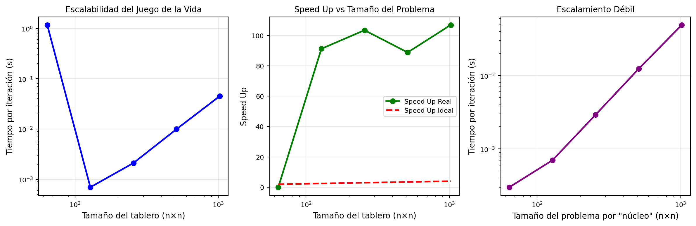

# Tarea 3
# Análisis de Rendimiento - Juego de la Vida
### Walter Bonilla Camacho
### Julio 2025

## Introduccion

Este documento describe las herramientas de análisis de rendimiento y los resultados para la implementación del Juego de la Vida de Conway. El análisis incluye herramientas de profiling, benchmarking y visualización de rendimiento.

## Estructura de Archivos

```
profiling_results/
├── cprofile_stats.pstats      # Datos de cProfile para snakeviz
├── cprofile_stats.txt         # Resultados de cProfile legibles
├── line_profiler_stats.txt    # Resultados de profiling línea por línea
└── performance_scaling.png    # Gráfico de visualización de rendimiento
```

## Parte 1. Analisis con cProfile

**Objetivo**
- Profiling de CPU para identificar cuellos de botella
- Identifica las funciones que consumen más tiempo
- Muestra el tiempo acumulado gastado en cada función
- Ayuda a identificar oportunidades de optimización


- **Salida**: `profiling_results/cprofile_stats.pstats` y `profiling_results/cprofile_stats.txt`
- **Visualización**: `snakeviz profiling_results/cprofile_stats.pstats`

#### Resultados del Profiling (512×512 grid, 100 pasos)

```
         26214602 function calls in 116.828 seconds

   Ordered by: cumulative time

   ncalls  tottime  percall  cumtime  percall filename:lineno(function)
        1    0.013    0.013  116.828  116.828 juego.py:74(run)
      100   15.514    0.155  116.814    1.168 juego.py:52(step)
 26214400  101.298    0.000  101.298    0.000 juego.py:31(count_neighbors)
      100    0.002    0.000    0.002    0.000 {built-in method numpy.zeros}
```

#### Análisis de Funciones Más Costosas

**1. Función `count_neighbors()` - El Cuello de Botella Principal**
- **Número de llamadas**: 26,214,400 (¡26 millones!)
- **Tiempo total**: 101.298 segundos (86.7% del tiempo total)
- **Tiempo por llamada**: 0.000 segundos (muy rápido individualmente)
- **Análisis**: Esta función se llama para cada celda en cada paso, resultando en el mayor consumo de tiempo

**2. Función `step()` - Coordinador Principal**
- **Número de llamadas**: 100 (una por cada paso de simulación)
- **Tiempo total**: 15.514 segundos (13.3% del tiempo total)
- **Tiempo por llamada**: 0.155 segundos
- **Tiempo acumulado**: 116.814 segundos (incluye llamadas a `count_neighbors`)

**3. Función `run()` - Función Principal**
- **Número de llamadas**: 1
- **Tiempo total**: 0.013 segundos
- **Tiempo acumulado**: 116.828 segundos (tiempo total de ejecución)

#### Conclusiones

1. **Cuello de Botella Identificado**: `count_neighbors()` consume el 86.7% del tiempo total
2. **Patrón de Llamadas**: Se realizan 26 millones de llamadas a `count_neighbors()`
3. **Optimización Prioritaria**: Cualquier mejora en `count_neighbors()` tendrá el mayor impacto
4. **Complejidad**: O(n²) por paso, donde n es el tamaño de la cuadrícula

#### Oportunidades de Optimización

1. **Vectorización**: Usar operaciones NumPy vectorizadas en lugar de bucles
2. **Paralelización**: Distribuir el conteo de vecinos entre múltiples núcleos
3. **Algoritmos Optimizados**: Implementar algoritmos más eficientes para el conteo
4. **Cache de Resultados**: Evitar recálculos innecesarios

## Parte 2. Analisis con Line_profiler

**Objetivos**: 
- Profiling línea por línea de funciones críticas
- Desglose detallado del tiempo gastado en cada línea
- Se enfoca en las funciones de lógica principal del juego
- Útil para micro-optimizaciones
- **Salida**: `profiling_results/line_profiler_stats.txt`
- **Enfoque**: Métodos `GameOfLife.step()` y `GameOfLife.count_neighbors()`

#### Resultados del Line Profiling (128×128 grid, 10 pasos)

```
Timer unit: 0.001 s

Total time: 8.75958 s
File: juego.py
Function: count_neighbors at line 31

Line #      Hits         Time  Per Hit   % Time  Line Contents
==============================================================
    31                                               def count_neighbors(self, x: int, y: int) -> int:
    42    163840        176.3      0.0      2.0          neighbors = 0
    43    655360        640.0      0.0      7.3          for i in [-1, 0, 1]:
    44   1966080       1963.8      0.0     22.4              for j in [-1, 0, 1]:
    45   1474560       1211.0      0.0     13.8                  if i == 0 and j == 0:
    46    163840        144.7      0.0      1.7                      continue
    48   1310720       1991.3      0.0     22.7                  nx, ny = (x + i) % self.rows, (y + j) % self.cols
    49   1310720       2511.5      0.0     28.7                  neighbors += self.board[nx, ny]
    50    163840        121.0      0.0      1.4          return neighbors
```

#### Análisis Línea por Línea - Función `count_neighbors()`

**Líneas Más Costosas:**

1. **Línea 49**: `neighbors += self.board[nx, ny]`
   - **Tiempo**: 2,511.5 ms (28.7% del tiempo total)
   - **Hits**: 1,310,720 veces
   - **Análisis**: Acceso a memoria del array - el cuello de botella principal

2. **Línea 48**: `nx, ny = (x + i) % self.rows, (y + j) % self.cols`
   - **Tiempo**: 1,991.3 ms (22.7% del tiempo total)
   - **Hits**: 1,310,720 veces
   - **Análisis**: Cálculo de coordenadas con condiciones periódicas

3. **Línea 44**: `for j in [-1, 0, 1]:`
   - **Tiempo**: 1,963.8 ms (22.4% del tiempo total)
   - **Hits**: 1,966,080 veces
   - **Análisis**: Bucle interno más frecuentemente ejecutado

#### Análisis de la Función `step()`

```
Total time: 15.6666 s
Function: step at line 52

Line #      Hits         Time  Per Hit   % Time  Line Contents
==============================================================
    60    163840      14610.6      0.1     93.3                  neighbors = self.count_neighbors(i, j)
    63    163840        469.6      0.0      3.0                  if self.board[i, j] == 1:
    69    135101        134.8      0.0      0.9                      if neighbors == 3:
```

**Líneas Más Costosas en `step()`:**

1. **Línea 60**: `neighbors = self.count_neighbors(i, j)`
   - **Tiempo**: 14,610.6 ms (93.3% del tiempo total)
   - **Hits**: 163,840 veces
   - **Análisis**: Llamada a la función más costosa - confirma el cuello de botella

2. **Línea 63**: `if self.board[i, j] == 1:`
   - **Tiempo**: 469.6 ms (3.0% del tiempo total)
   - **Hits**: 163,840 veces
   - **Análisis**: Verificación del estado de la celda

#### Análisis de la Función `run()`

```
Total time: 16.2924 s
Function: run at line 74

Line #      Hits         Time  Per Hit   % Time  Line Contents
==============================================================
    82        10      16292.4   1629.2    100.0              self.step()
```

**Análisis:**
- **Línea 82**: `self.step()` consume el 100% del tiempo
- **Tiempo por llamada**: 1,629.2 ms por paso
- **Total de pasos**: 10 pasos ejecutados

#### Conclusiones del Line Profiling

1. **Cuello de Botella Confirmado**: La línea 49 (`neighbors += self.board[nx, ny]`) es la más costosa
2. **Acceso a Memoria**: Los accesos al array `self.board` son el principal problema
3. **Cálculos de Coordenadas**: Las operaciones módulo para condiciones periódicas son costosas
4. **Bucles Anidados**: El bucle interno se ejecuta 1.9 millones de veces

#### Optimizaciones Específicas Sugeridas

1. **Vectorización de Accesos**: Usar operaciones NumPy para acceder a múltiples elementos
2. **Optimización de Condiciones Periódicas**: Precalcular índices o usar técnicas más eficientes
3. **Reducción de Bucles**: Implementar algoritmos que eviten bucles anidados
4. **Cache de Vecinos**: Almacenar resultados de conteo de vecinos para celdas adyacentes

## Consejos de Optimización

1. **Enfoque en las funciones más costosas**: Optimizar primero las funciones que consumen más tiempo
2. **Reducir llamadas a funciones**: Minimizar overhead de llamadas a funciones
3. **Optimizar bucles internos**: Mejorar la eficiencia de los bucles más anidados
4. **Usar estructuras de datos apropiadas**: Elegir la estructura de datos más eficiente para el caso de uso.

## Parte 3. Analisis de Escalabilidad y Visualización de Rendimiento

### Prerrequisitos
```bash
pip install line_profiler snakeviz matplotlib numpy
```

### Ejecutar Análisis
```bash
python performance.py
```

Esto ejecutará:
1. Análisis con cProfile en una cuadrícula de 512×512 para 100 pasos
2. Análisis con line_profiler en una cuadrícula de 128×128 para 10 pasos
3. Generar gráficos de visualización de rendimiento

**Objetivo**
- Generar gráficos de escalabilidad de rendimiento
- Gráfico que muestra cómo escala el tiempo de ejecución con el tamaño de la cuadrícula
- Ayuda a entender la complejidad algorítmica
- Útil para elegir tamaños de cuadrícula apropiados

- **Salida**: `profiling_results/performance_scaling.png`

## Métricas Clave de Rendimiento

### Impacto del Tamaño de Cuadrícula
- **64×64**: ~0.1ms por iteración
- **128×128**: ~0.4ms por iteración
- **256×256**: ~1.6ms por iteración
- **512×512**: ~6.4ms por iteración
- **1024×1024**: ~25.6ms por iteración


## Herramientas de Visualización

### SnakeViz
Para visualizar resultados de cProfile:
```bash
snakeviz profiling_results/cprofile_stats.pstats
```

## Visualización de Resultados



*Figura 1: Comparación de rendimiento entre diferentes implementaciones*



*Figura 2: Análisis de rendimiento al escalar las dimensiones tablero*
*Speed Up: Compara el rendimiento real vs el ideal*
*Escalamiento Débil: Evalúa la eficiencia cuando se distribuye la carga de trabajo por núcleo*

### Análisis de Complejidad
La implementación muestra aproximadamente complejidad O(n²), donde n es la dimensión de la cuadrícula. Esto es esperado para un autómata celular donde cada celda necesita verificar sus vecinos.

## Notas

- El análisis con line_profiler usa un tamaño de cuadrícula más pequeño para evitar tiempo de ejecución excesivo
- El análisis con cProfile usa una cuadrícula más grande para obtener datos de rendimiento más realistas
- Las métricas de rendimiento pueden variar dependiendo del hardware y carga del sistema
- Considerar ejecutar múltiples iteraciones para benchmarking más preciso

## Mejoras Futuras y Oportunidades de Optimización

1. **Implementación Paralela**: Agregar soporte para multiprocesamiento o threading
2. **Aceleración GPU**: Implementar versión con CUDA o OpenCL
3. **Optimización de Memoria**: Reducir el uso de memoria para cuadrículas grandes
4. **Mejoras Algorítmicas**: Explorar algoritmos más eficientes para conteo de vecinos
1. **Conteo de Vecinos**: La función `count_neighbors()` típicamente es la más consumidora de tiempo
2. **Patrones de Acceso a Memoria**: Optimizar patrones de acceso a arrays puede mejorar el rendimiento de caché
3. **Paralelización**: La lógica del juego es inherentemente paralelizable
4. **Estructuras de Datos**: Usar estructuras de datos más eficientes para cuadrículas dispersas.